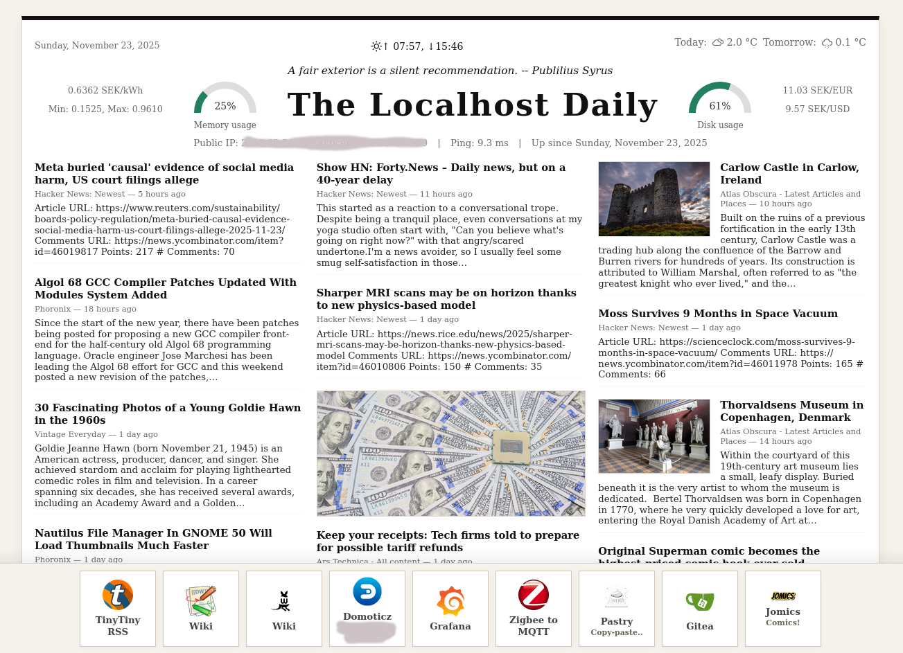

## The Localhost Daily



**Localhost Daily** generates a newspaper‑style front page from a collection of RSS feeds, plus data such as electricity price, currency exchange rates, weather forecasts, and server information.

---

## Table of Contents
1. [Building](#building)  
2. [Installation & Usage](#installation--usage)  
3. [Running Automatically](#running-automatically)  
4. [Limitations](#limitations)  
5. [External Dependencies](#external-dependencies)  

---

## Building

The project is written in **Go**, so you need the Go toolchain installed.

```bash
# Clone the repository (if you haven't already)
git clone https://github.com/gmelchett/localhost-daily.git
cd localhost-daily

# Build the binary
go build
```

The resulting executable (`localhost-daily`) will be placed in the current directory.

---

## Installation & Usage

### Typical workflow

1. **Generate the static page**  

   ```bash
   ./localhost-daily -config config.toml -output ~/www
   ```

   This creates `index.html` in `~/www`.

2. **Copy required assets**  

   To display correctly in a browser, copy the following directories from the repository into the same folder as `index.html`:

   ```
   css/
   fonts/
   favicons/
   ```
   You also need to put eventual link icons into the same directory as index.html

3. **Configure**  

   Edit `config.toml` to specify your RSS feeds, API keys, and other preferences. See the provided `config.toml`

---

## Running Automatically

Schedule regular page generation with `cron`. A typical hourly entry looks like:

```cron
0 * * * * /path/to/localhost-daily -config /path/to/config.toml -output /var/www/html/index.html >> /var/log/localhost-daily.log 2>&1
```

### Cache cleanup

Images are cached in `~/.cache/gmelchett/localhost-daily`. To prevent unbounded growth, add a periodic cleanup, e.g.:

```bash
# Delete cached files older than 7 days
find ~/.cache/gmelchett/localhost-daily -type f -mtime +7 -delete
```

You can place this command in a separate cron job.

---

## Limitations
This program is vibe coded. The go code looks copy-pasted together, and it is. I don't know html/css good enough to
judge the quality there. However, it looks decent in a web browser. Also, several features are only valid in Sweden, like
electricity price information. Probably the weather forecast is also Sweden only, but I don't know.

---

## External Dependencies

The program invokes a few external utilities:

- `ping` – for simple server reachability checks  
- `fortune` – optional, for random quotes displayed on the front page  


## Third party
- Weather CSS and fonts comes from: http://erikflowers.github.io/weather-icons
- LibreBaskerville font


## License
html/css and go code is MIT. But honestly, since most is LLM generated, I don't really know.
